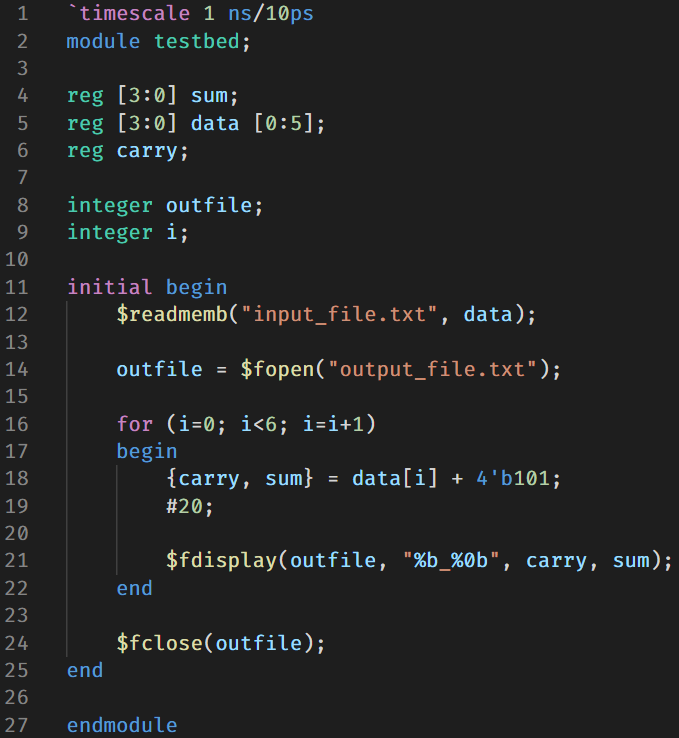

# Verilog highlight

verilog-highlight uses TextMate to highlight verilog files in vscode.

## Features

### Highlighting

- Highlights escape strings and escape sequences in string literals
- Highlights size and base parts of numeric literals

### Grammar

- Grammar rule naming follows IEEE 1364

## Requirements

none

## Extension Settings

| Name                    | Description                                                                                     |
| ----------------------- | ----------------------------------------------------------------------------------------------- |
| `editor.wordSeparators` | Overrides default word separators for verilog. Makes it easier to select number and text macro. |

## Known Issues

## Release Notes

### 1.0.0

Initial release
